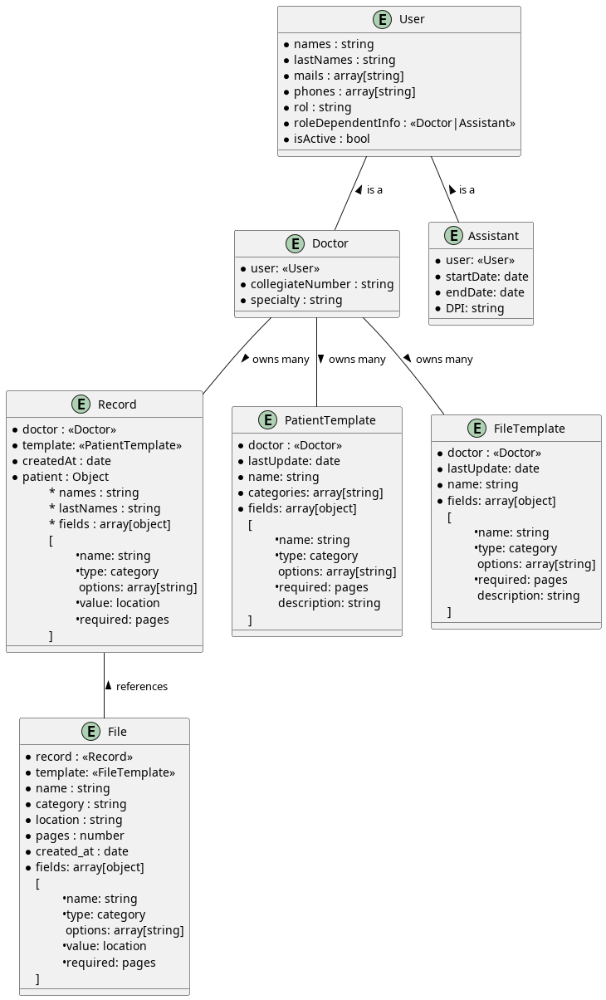

<h1 align="center">📦 Therapist Track</h1>
<h3 align="center"> Database </h3>

The App uses Mongo DB as database. Following is the squema design and relation between documents. But first some notation conventions:

## Environment variables

The `compose.yaml` needs some env variables in order to initialize the DB correctly. This is an example of such `.env` file (must be placed in the root of the project):

```bash
# DATABASE
DB_ADMIN_USER=user
DB_ADMIN_PASSWORD=password
DB_NAME=therapisttrack
DB_USER=admin
DB_USER_PASSWORD=1234
DB_PORT=27017
```

## Notation

1. **Required Fields** : When an field is obligatory, is preceded by `•`. Ex: `• name`

2. **Foreign Keys**: Are references to documents of other collections. Are denoted as `<<CollectionName>>`. Ex: `<<Rol>>`

3. **Embed Document and Arrays of Documents**: Are denoted as :
   
   ```javascript
   <fieldName> : object
   {
      childAttribute : type
   }
   
   // EXAMPLE :
   family : object
   {
      dad : string,
      mother : string
   }
   ```

# DB Schema Diagram



# Fields Dictionary

Below is a a list of examples of the JSON that is expected to be stored in each collection

### User

```javascript
{
    _id : ObjectId("1234") // Sames as Auth0
    names: "Johan Rodrigo",
    lastNames: "Rodriguez Rando",
    mails: ["email1@gmail.com", "hotmail2@hotmail.com"],
    phones: ["32232334", "44442222"],
    rol: "Doctor",
    roleDependentInfo: ObjectId("dfd32cak32..54?123/"),
    isActive: true
}
```

### Doctor

```javascript
{
    user: ObjectId("dsafsdaf"),
    collegiateNumber: "41234",
    specialty: "family",
}
```

### Assistant

```javascript
{
    user: ObjectId("dsafsdaf"),
    startDate: "2020-05-11",
    endDate: "2024-04-11",
    DPI: "421322004221"
}
```

### Record

```javascript
{
    doctor: ObjectId("dk32lv..32//asd"),
    template : ObjectId("asdfwk32?932l")
    createdAt: "2023-1-2"
    patient : {
        names: "Shinji",
        lastNames: "Sakamoto",
        fields: [
            {
                name: "Children",
                type: "NUMBER",
                value : 3,
                required: false,
            },
            {
                name: "civil status",
                type: "CHOICE",
                options: ["single", "married", "separate"],
                value : "single",
                required: true,
            },
        ]
    }
}
```

### FileTemplate

```javascript
{
    doctor : ObjectId("asdfwk32?932l")
    lastUpdated: "2023-1-2",
    name: "Plantilla2024",
    metadata: [
        {
            name: "Difficulty",
            type: "CHOICE",
            /* 'type' only accept the values:
                  'SHORT_TEXT',
                  'TEXT',
                  'DATE',
                  'NUMBER',
                  'FLOAT',
                  'CHOICE' */
            options: ["easy", "medium", "hard"],
            required: true,
            description: "How hard this sessions has to the patient."
        },
        {
            name: "Key Words",
            type: "SHORT_TEXT",
            required: false,
        },
    ]
}
```

### File

```javascript
{
    record: ObjectId("dfasdf"),
    template: ObjectId("df23;ldf")
    name: "test1",
    category: "test", // corresponding to the PatientTemplate categories field.
    location: "./route/to/file/in/disk.pdf",
    pages: 3
    created_at: "2023-1-2"
    metadata: [
        {
            name: "Difficulty",
            type: "CHOICE",
            options: ["easy", "medium", "hard"],
            value: "easy"
            required: true,
        },
        {
            name: "Key Words",
            type: "SHORT_TEXT",
            value: "depression, ADHD"
            required: false,
        },
    ]
}
```

### PatientTemplate

```javascript
{
    doctor : ObjectId("asdfwk32?932l")
    lastUpdated: '2023-1-2',
    name: "Plantilla2024",
    categories: ["test", "sessions", "legal Documents"],
    fields: [
    {
        name: 'Children',
        type: 'NUMBER',
        required: false,
        description: 'Number of children the Patient has'
    },
    {
        name: 'civil status',
        type: 'CHOICE',
        options: ['single', 'married', 'separate'],
        required: true
    }
  ]
}
```